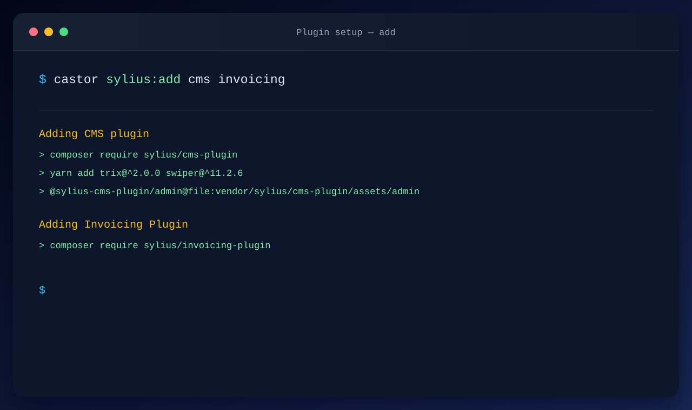
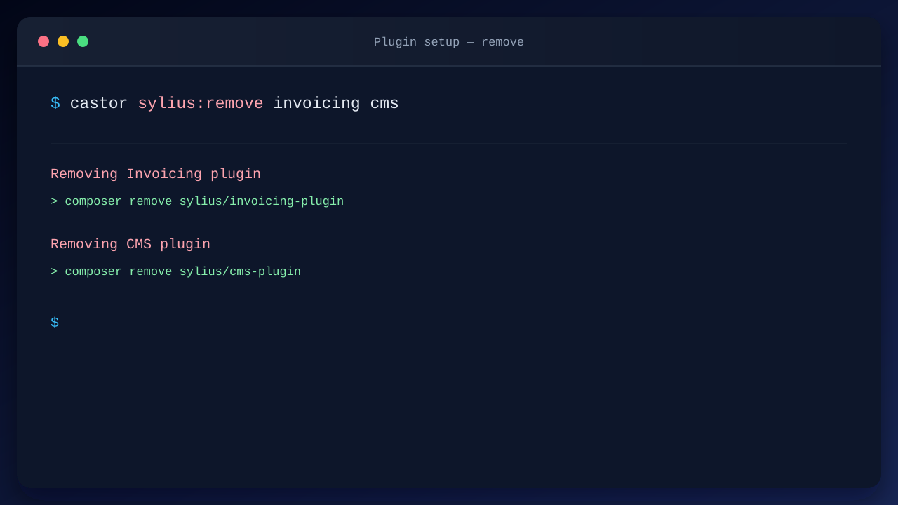
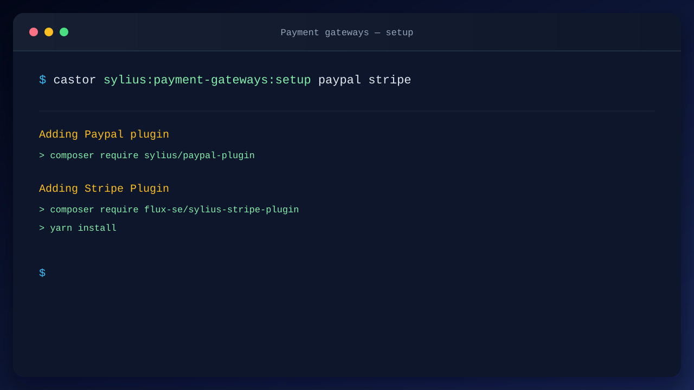
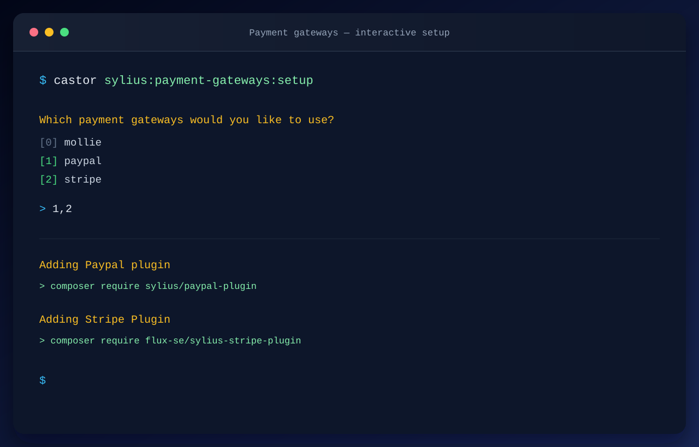
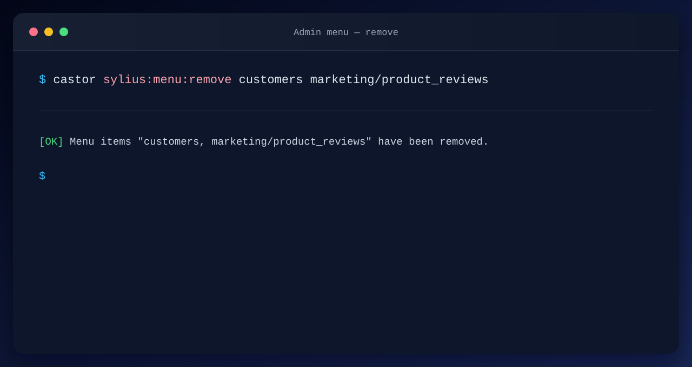
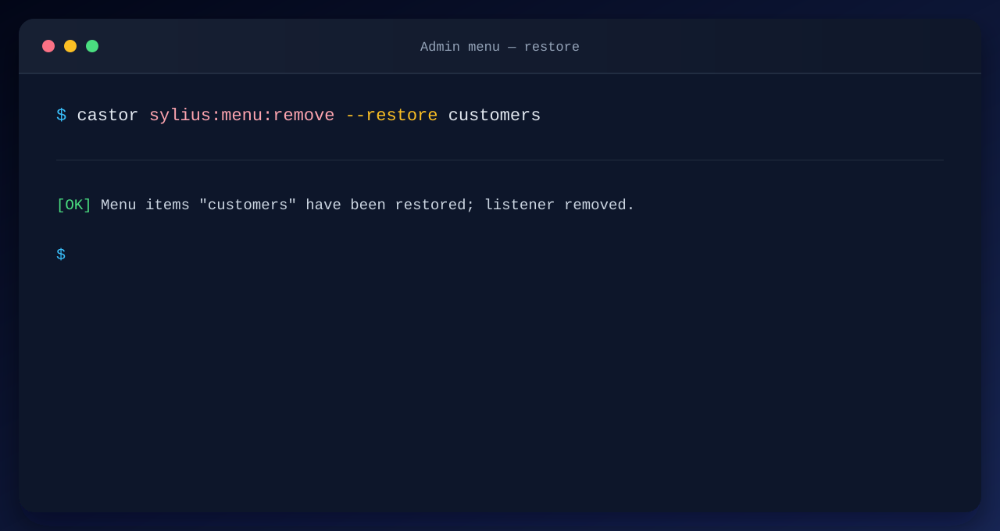
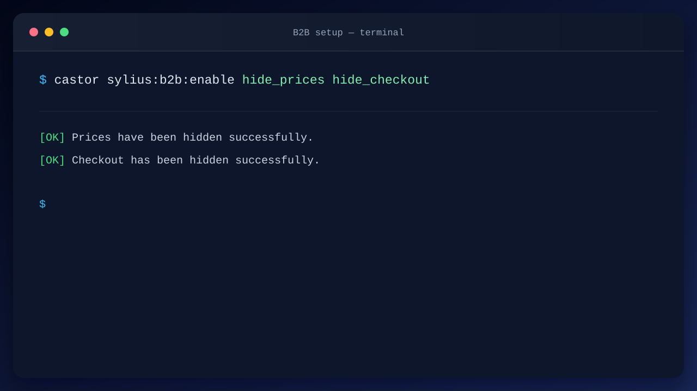
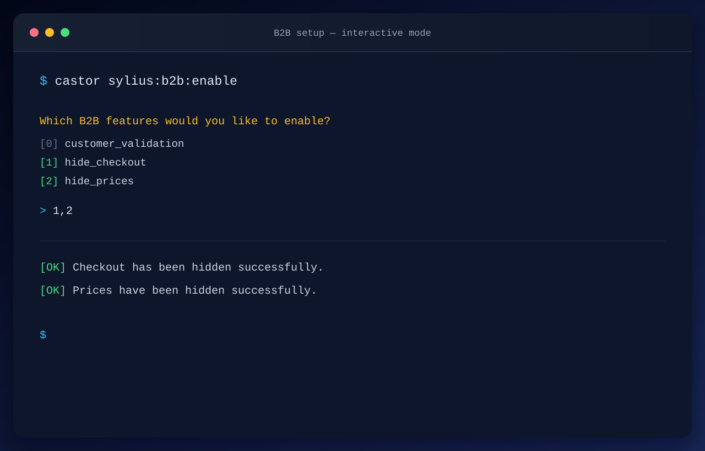

# Sylius Starter

A set of [Castor](https://castor.jolicode.com/) packages that turns a PHP description of
your stack into a Sylius app, and gives you the tasks to drive it.

> Formerly the `castor-php/sylius` Castor plugin. The code now lives in this monorepo and is
> published as several `sylius-starter/*` packages, see [Packages](#-packages).

<!-- TOC -->

* [Why Castor Sylius?](#why-sylius-starter)
* [Installation](#installation)
* [📦 Packages](#-packages)
* [🦫 Available commands](#-available-commands)
    * [Add or Remove plugins](#add-or-remove-plugins)
        * [✚ Add plugins](#-add-plugins)
        * [Available plugins](#available-plugins)
        * [❌ Remove plugins](#-remove-plugins)
        * [Available plugins](#available-plugins-1)
    * [💳 Setup payment gateways](#-setup-payment-gateways)
        * [Available payment gateways](#available-payment-gateways)
    * [🎨 Setup a theme](#-setup-a-theme)
        * [Available themes](#available-themes)
    * [☰ Remove menu items from the Admin panel](#-remove-menu-items-from-the-admin-panel)
        * [Available options](#available-options)
        * [Default menu items](#default-menu-items)
    * [💼 Enable B2B features](#-enable-b2b-features)
        * [Examples](#examples)
        * [Available features](#available-features)
        * [Hide prices for anonymous users](#hide-prices-for-anonymous-users)
        * [Hide checkout for anonymous users](#hide-checkout-for-anonymous-users)
        * [Admin validation for new users](#admin-validation-for-new-users)
    * [☁️ Check Upsun configuration](#️-check-upsun-configuration)
* [E-commerce import](#e-commerce-import)
    * [Prerequisites](#prerequisites)
    * [AI Generated Catalog](#ai-generated-catalog)
        * [Generate a catalog from a description](#generate-a-catalog-from-a-description)
        * [Generate the Sylius fixtures files](#generate-the-sylius-fixtures-files)
        * [Load the fixture suite](#load-the-fixture-suite)
    * [Using data from an existing website](#using-data-from-an-existing-website)
* [🧩 Extending the plugin](#-extending-the-plugin)
    * [Available attributes](#available-attributes)
    * [Declaring a component](#declaring-a-component)
        * [As a function](#as-a-function)
        * [As a class](#as-a-class)
    * [The App instance](#the-app-instance)
    * [Helpers](#helpers)
    * [Good to know](#good-to-know)
* [🏗️ Monorepo & contributing](#️-monorepo--contributing)
    * [Layout](#layout)
    * [Monorepo tasks](#monorepo-tasks)
    * [Splitting packages in the CI](#splitting-packages-in-the-ci)
    * [Adding a package](#adding-a-package)
* [License](#license)

<!-- TOC -->

## Why Sylius Starter?

Castor Sylius provides a higher-level interface for building, configuring and operating a Sylius application.

It goes beyond Symfony Flex recipes: instead of only installing and configuring packages, it can orchestrate complete
project workflows — from setting up payment gateways and storefront themes to enabling B2B features, customizing the
Admin panel, running Doctrine migrations, building assets, managing Docker services, or importing a catalog.

It can also safely modify the application itself when needed, using AST-based transformations for PHP files and
dedicated helpers for YAML, JavaScript and Symfony configuration.

For example, removing a payment gateway such as Mollie may require more than a `composer remove`: Doctrine entities may
need to be updated, the plugin's migrations rolled back, assets rebuilt and the application cache cleared. Castor Sylius
can encode this entire workflow as a single, deterministic command.

This becomes particularly valuable when working with AI. Instead of asking Claude or Codex to discover all the required
steps, inspect the project and modify multiple files, Castor provides the AI with a known, high-level interface for
operating a Sylius application.

The result is less guesswork, fewer tokens spent on repetitive tasks, and more reliable changes to the project.

## Installation

1. Create a `castor.php` file in your project root:

2. Create a composer file for Castor:

```bash
echo '{}' > castor.composer.json
```

3. Install Sylius Starter (every package at once)

```bash
castor composer require sylius-starter/sylius-starter "@dev"
```

Or pick only what you need: `sylius-starter/core` is always required, then add the task packages you want, e.g.

```bash
castor composer require sylius-starter/core sylius-starter/themes sylius-starter/plugins "@dev"
```

4. Setup a new Sylius application

```bash
castor docker:service:install sylius
```

## 📦 Packages

| Package                                                                                 | Namespace                       | Tasks                                                                 |
|-----------------------------------------------------------------------------------------|---------------------------------|-----------------------------------------------------------------------|
| [`sylius-starter/core`](https://github.com/sylius-starter/core)                         | `SyliusStarter\Core`            | Castor plugin: `SyliusService`, installer, `sylius:fixtures`, helpers |
| [`sylius-starter/plugins`](https://github.com/sylius-starter/plugins)                   | `SyliusStarter\Plugins`         | `sylius:plugin:add`, `sylius:plugin:remove`                           |
| [`sylius-starter/payment-gateways`](https://github.com/sylius-starter/payment-gateways) | `SyliusStarter\PaymentGateways` | `sylius:payment-gateways:setup`                                       |
| [`sylius-starter/themes`](https://github.com/sylius-starter/themes)                     | `SyliusStarter\Themes`          | `sylius:theme:setup`                                                  |
| [`sylius-starter/menu`](https://github.com/sylius-starter/menu)                         | `SyliusStarter\Menu`            | `sylius:menu:remove`                                                  |
| [`sylius-starter/b2b`](https://github.com/sylius-starter/b2b)                           | `SyliusStarter\B2b`             | `sylius:b2b:enable`                                                   |
| [`sylius-starter/import`](https://github.com/sylius-starter/import)                     | `SyliusStarter\Import`          | `sylius:import:*`                                                     |
| [`sylius-starter/upsun`](https://github.com/sylius-starter/upsun)                       | `SyliusStarter\Upsun`           | `sylius:upsun:check`                                                  |
| `sylius-starter/sylius-starter`                                                         | —                               | All of the above (this repository)                                    |

The core is the Castor plugin itself. Every other package only contributes tasks: it registers them in the core
from a file autoloaded by Composer, so installing a package is enough to get its tasks on your `SyliusService`.

### Upgrading from `castor-php/sylius`

Replace the package in your `castor.composer.json` (`castor composer remove castor-php/sylius` then require
`sylius-starter/sylius-starter`) and update your imports:

| Before                                                    | After                                                           |
|-----------------------------------------------------------|-----------------------------------------------------------------|
| `Castor\Sylius\Service\SyliusService`                     | `SyliusStarter\Core\Service\SyliusService`                      |
| `Castor\Sylius\App`, `Castor\Sylius\Util\*`               | `SyliusStarter\Core\App`, `SyliusStarter\Core\Util\*`           |
| `Castor\Sylius\Attribute\AsPluginInstaller` / `Remover`   | `SyliusStarter\Plugins\Attribute\AsPluginInstaller` / `Remover` |
| `Castor\Sylius\Attribute\AsPaymentGateway*`               | `SyliusStarter\PaymentGateways\Attribute\AsPaymentGateway*`     |
| `Castor\Sylius\Attribute\AsTheme*`                        | `SyliusStarter\Themes\Attribute\AsTheme*`                       |
| `Castor\Sylius\Plugin\Installer\PluginInstallerInterface` | `SyliusStarter\Core\Component\InstallerInterface`               |
| `Castor\Sylius\Plugin\Remover\PluginRemoverInterface`     | `SyliusStarter\Core\Component\RemoverInterface`                 |

## 🦫 Available commands

### Add or Remove plugins

Install or uninstall Sylius plugins with simple commands.

> **Note:** Payment gateways are managed separately with `sylius:payment-gateways:setup`.

#### ✚ Add plugins

A single command to add all the Sylius plugins you need.

**Example:**

```bash
castor sylius:add cms invoicing refund
```



#### Available plugins

| Plugin         | Description                                        |
|----------------|----------------------------------------------------|
| ai_dev_tools   | Dev-only AI tooling for Sylius                     |
| altcha         | ALTCHA captcha to customer registration            |
| bugsnag        | Official BugSnag notifier for Symfony applications |
| cms            | CMS plugin for Sylius applications                 |
| gdpr           | Synolia sylius GDPR plugin                         |
| invoicing      | Invoicing plugin for Sylius                        |
| media          | Media management bundle for Symfony applications   |
| product_bundle | Product bundle for Sylius                          |
| refund         | Basic refunds functionality for Sylius             |
| recaptcha      | Google reCAPTCHA v3 to customer registration       |
| wishlist       | Wishlist plugin for Sylius                         |

> **Note:** these descriptions are the ones displayed next to each plugin in the interactive prompt.

> **Note:** You can [register your own plugins](#-extending-the-plugin) with the `AsPluginInstaller` and
> `AsPluginRemover` attributes.

#### ❌ Remove plugins

A single command to remove the Sylius plugins you do not need anymore.

**Example:**

```bash
castor sylius:remove invoicing cms
```



#### Available plugins

| Plugin       | Description                                        |
|--------------|----------------------------------------------------|
| ai_dev_tools | Dev-only AI tooling for Sylius                     |
| altcha       | ALTCHA captcha to customer registration            |
| api          | Sylius API and its test tooling                    |
| bugsnag      | Official BugSnag notifier for Symfony applications |
| cms          | CMS plugin for Sylius applications                 |
| gdpr         | Synolia sylius GDPR plugin                         |
| invoicing    | Invoicing plugin for Sylius                        |
| recaptcha    | Google reCAPTCHA v3 to customer registration       |
| wishlist     | Wishlist plugin for Sylius                         |

### 💳 Setup payment gateways

Configure which payment gateways are active in your Sylius application.

> **Note:** Payment gateways have their own dedicated command and are not managed through
> `sylius:add` / `sylius:remove` by design.

A single command to setup which payment gateways you want to use in your Sylius application. By default, only installs
the
selected gateways. Pass `--only` to also remove unselected gateways.

**Example:**

```bash
castor sylius:payment-gateways:setup stripe
```

You can also pass multiple gateways:

```bash
castor sylius:payment-gateways:setup paypal stripe
```



If no arguments are provided, an interactive prompt will ask you to choose the payment gateways.



**Remove unselected gateways:**

```bash
castor sylius:payment-gateways:setup --only stripe
```

#### Available payment gateways

| Gateway | Description                         |
|---------|-------------------------------------|
| mollie  | Setup Sylius Mollie payment gateway |
| paypal  | Setup Sylius Paypal payment gateway |
| stripe  | Setup Sylius Stripe payment gateway |

> **Note:** You can [register your own gateways](#-extending-the-plugin) with the `AsPaymentGatewayInstaller` and
> `AsPaymentGatewayRemover` attributes.

### 🎨 Setup a theme

Install a storefront theme in your Sylius application. Only one theme can be active:
installing a theme automatically removes any other previously installed theme.

If no argument is provided, an interactive prompt will ask you to choose the theme.

**Example:**

```bash
castor sylius:theme:setup canvas
```

#### Available themes

| Preview                                                                                                                                        | Theme                                       | Description                                                                                |
|------------------------------------------------------------------------------------------------------------------------------------------------|---------------------------------------------|--------------------------------------------------------------------------------------------|
| <a href="docs/themes/canvas.md"></a>                   | [Canvas](docs/themes/canvas.md)             | [Install the Canvas storefront theme](docs/themes/canvas.md)                               |
| <a href="docs/themes/blush.md"></a>                      | [Blush](docs/themes/blush.md)               | [Install the Blush storefront theme](docs/themes/blush.md)                                 |
| <a href="docs/themes/prompt_dark.md"></a>    | [Prompt Dark](docs/themes/prompt_dark.md)   | [Install the dark terminal-inspired Prompt storefront theme](docs/themes/prompt_dark.md)   |
| <a href="docs/themes/prompt_light.md"></a> | [Prompt Light](docs/themes/prompt_light.md) | [Install the light terminal-inspired Prompt storefront theme](docs/themes/prompt_light.md) |
| <a href="docs/themes/volt.md"></a>                         | [Volt](docs/themes/volt.md)                 | [Install the sport-tech Volt storefront theme](docs/themes/volt.md)                        |
| <a href="docs/themes/lagoon.md"></a>                   | [Lagoon](docs/themes/lagoon.md)             | [Install the airy teal-and-aqua Lagoon storefront theme](docs/themes/lagoon.md)            |
| —                                                                                                                                              | default                                     | No theme applied; rebuilds the application assets                                          |

> **Note:** You can [register your own themes](#-extending-the-plugin) with the `AsThemeInstaller` and `AsThemeRemover`
> attributes.

### ☰ Remove menu items from the Admin panel

Clean up the Sylius Admin panel by removing menu items you don't need.

This command generates `application/src/Menu/Admin/RemoveMenuItemsListener.php`, a Symfony
event listener that hides matching items from the admin main menu. Subsequent runs
automatically merge new items into the existing list without prompting.

Pass one or more menu item names as arguments. Use `parent/child` syntax for sub-items.

**Example:**

```bash
castor sylius:menu:remove official_support sylius.ui.administration
castor sylius:menu:remove marketing/product_reviews
```



#### Available options

| Option    | Shortcut | Description                                                                        |
|-----------|----------|------------------------------------------------------------------------------------|
| --replace | -r       | Replace the full removed-items list instead of merging with existing items         |
| --restore | -b       | Restore previously removed menu items; deletes the listener when the list is empty |

**Replace the removed-items list:**

```bash
castor sylius:menu:remove customers orders --replace
```

**Restore previously removed items:**

```bash
castor sylius:menu:remove --restore customers
castor sylius:menu:remove -b customers orders
```



**Example workflow:**

```bash
# Hide customers and orders from the admin menu
castor sylius:menu:remove customers orders

# Later, hide product reviews too (auto-merged)
castor sylius:menu:remove marketing/product_reviews

# Restore the customers menu item
castor sylius:menu:remove -b customers
```

#### Default menu items

Top-level items:

| Name                     | Description      |
|--------------------------|------------------|
| dashboard                | Dashboard        |
| catalog                  | Catalog          |
| sales                    | Sales            |
| customers                | Customers        |
| marketing                | Marketing        |
| configuration            | Configuration    |
| official_support         | Official Support |
| sylius.ui.administration | Administration   |

Sub-items (use `parent/child` syntax):

| Name                                   | Description           |
|----------------------------------------|-----------------------|
| catalog/taxons                         | Taxons                |
| catalog/products                       | Products              |
| catalog/inventory                      | Inventory             |
| catalog/attributes                     | Attributes            |
| catalog/options                        | Options               |
| catalog/association_types              | Association Types     |
| sales/orders                           | Orders                |
| sales/payments                         | Payments              |
| sales/shipments                        | Shipments             |
| customers/customers                    | Customers             |
| customers/groups                       | Groups                |
| marketing/promotions                   | Promotions            |
| marketing/catalog_promotions           | Catalog Promotions    |
| marketing/product_reviews              | Product Reviews       |
| configuration/channels                 | Channels              |
| configuration/countries                | Countries             |
| configuration/zones                    | Zones                 |
| configuration/currencies               | Currencies            |
| configuration/exchange_rates           | Exchange Rates        |
| configuration/locales                  | Locales               |
| configuration/payment_methods          | Payment Methods       |
| configuration/shipping_methods         | Shipping Methods      |
| configuration/shipping_categories      | Shipping Categories   |
| configuration/tax_categories           | Tax Categories        |
| configuration/tax_rates                | Tax Rates             |
| configuration/admin_users              | Admin Users           |
| official_support/sylius_plus           | Sylius Plus           |
| official_support/browse_plugins        | Browse Plugins        |
| official_support/professional_services | Professional Services |
| official_support/find_a_partner        | Find a Partner        |
| official_support/sylius_certification  | Sylius Certification  |
| sylius.ui.administration/roles         | Roles                 |

### 💼 Enable B2B features

Turn on B2B features for your Sylius shop. Pass one or more feature identifiers as arguments:

```bash
castor sylius:b2b:enable hide_prices hide_checkout customer_validation
```

If no arguments are provided, an interactive choice lets you select the features to enable.

> **Note:** The command copies the matching resources into your application.

#### Examples





#### Available features

| Feature               | Description                                         |
|-----------------------|-----------------------------------------------------|
| `hide_prices`         | Hide prices for anonymous users                     |
| `hide_checkout`       | Hide the checkout for anonymous users               |
| `customer_validation` | Require admin approval before customers can sign in |

#### Hide prices for anonymous users

Hides product prices (product cards, product details page and lowest price before discount) from visitors who are not
logged in. Prices remain visible to logged-in customers.

#### Hide checkout for anonymous users

Removes the "Add to cart" button on the product details page and hides the cart from the header for guests. Cart and
checkout routes return a 403 for them.

Both features rely on Twig Hooks hookable conditions (`condition: '@=is_granted("CAN_ACCESS_B2B_SHOP")'`) rather than
template overrides, so they require `sylius/twig-hooks` 0.14+ (the command upgrades it if needed). To change who can
see prices and checkout, adapt `App\Security\CanAccessB2bShopVoter`.

#### Admin validation for new users

Require an administrator to approve new customers before they can sign in. Enable the feature with:

```bash
castor sylius:b2b:enable customer_validation
```

New customers are created **disabled** and start in the `customer_validation` workflow (`new` → `accepted` /
`rejected`). After registration, customers receive an email explaining that their account is awaiting administrator
approval. The same message is shown on the registration confirmation page and as the registration success notification.
These messages are available in English and French. The standard Sylius registration email remains suppressed until a
customer is accepted.

In the Admin panel, this feature:

- adds `state`, `localeCode` and `registrationChannel` fields to the `Customer` entity;
- displays the validation state in the customer grid, with a filter for `new`, `accepted` and `rejected`;
- adds **Accept** / **Reject** actions to the customer grid and customer show page;
- displays a count of customers waiting for validation in the dashboard pending actions;
- generates a Doctrine migration for the new columns and prompts you to run it (you can run it later if you decline);
- enables the user and sends the standard Sylius registration email when a customer is **accepted**;
- leaves the user disabled when a customer is **rejected**.

### ☁️ Check Upsun configuration

Sylius Standard already ships an official `.upsun/config.yaml`. This read-only check validates that the file is present
and
defines Upsun applications, then compares the locally linked Castor database, the application's Doctrine DBAL driver,
and the declared Upsun database service. It checks explicit Doctrine drivers first and supports the standard
`DATABASE_URL` configuration as a fallback. If an engine cannot be determined, it reports that instead of guessing.

```bash
castor sylius:upsun:check
```

The check uses the configured Symfony environment, does not generate or modify Upsun or Doctrine configuration, and does
not run Upsun or Symfony CLI commands.

## E-commerce import

Import products, collections, images and prices from an **AI-generated catalog**, or load YAML produced by an external
fetch step into Sylius fixtures.

### Prerequisites

1. Make sure you have already set up your Sylius application using the `castor docker:service:install sylius` command.

2. Configure AI in .castor/.env (created automatically when you run the first import command). You can copy the default
   values from .castor/.env.example.

You can also create a .castor/.env.local file for your sensitive values or local overrides.

| Variable         | Default                  | Description                             |
|------------------|--------------------------|-----------------------------------------|
| `AI_PROVIDER`    | `openrouter`             | `ollama` (local) or `openrouter`        |
| `AI_MODEL`       | provider-specific        | Text / structured-output model          |
| `AI_IMAGE_MODEL` | provider-specific        | Image generation model (AI import only) |
| `AI_BASE_URL`    | `http://127.0.0.1:11434` | Ollama URL (ignored for OpenRouter)     |
| `AI_API_KEY`     | —                        | Required when `AI_PROVIDER=openrouter`  |

### AI Generated Catalog

#### Generate a catalog from a description

Generate a complete product catalog from a natural-language description using AI. The generated catalog is saved as YAML
and can then be used to generate Sylius fixtures.

```bash
castor sylius:import:ai:build \
    --name="Organic Kids" \
    --description="An online store selling organic clothes for children"
```

This will generate a catalog for Organic Kids, including products and collections, based on the provided description.
Import data is stored per project slug under `.castor/import/var/{project-slug}/`.

#### Generate the Sylius fixtures files

```bash
castor sylius:import:fixtures:generate ai --project="Organic Kids" --limit=100
```

#### Load the fixture suite

```bash
castor sylius:import:fixtures:load --project="Organic Kids"
```

### Using data from an existing website

It requires a YAML import under `.castor/import/var/{project-slug}/` (products + collections). If you use the private
`castor-php/sylius-import-fetch` plugin, run `sylius:import:existing:fetch` first; otherwise prepare the YAML yourself.

```bash
castor sylius:import:fixtures:generate existing --project=example --limit=100
castor sylius:import:fixtures:load --project=example
```

## 🧩 Extending the plugin

The lists above are not closed: you can add your own plugins, themes and payment gateways to the commands, from your
own `castor.php` (or from any file it `import()`s), using the attributes shipped with each package.

Once registered, your component is offered in the interactive prompt of its command **and** is callable by name on the
command line, exactly like a built-in one.

### Available attributes

The attributes live in the `Attribute` namespace of their package (`SyliusStarter\Plugins\Attribute`,
`SyliusStarter\PaymentGateways\Attribute` and `SyliusStarter\Themes\Attribute`), take a required `name` argument,
and can be put on a function or on a class.

| Attribute                                           | Command                                              | Called when                            |
|-----------------------------------------------------|------------------------------------------------------|----------------------------------------|
| `#[AsPluginInstaller(name: '…', description: '…')]` | `castor sylius:add <name>`                           | `sylius:add` picks the plugin          |
| `#[AsPluginRemover(name: '…', description: '…')]`   | `castor sylius:remove <name>`                        | `sylius:remove` picks the plugin       |
| `#[AsPaymentGatewayInstaller(name: '…')]`           | `castor sylius:payment-gateways:setup <name>`        | the gateway is selected                |
| `#[AsPaymentGatewayRemover(name: '…')]`             | `castor sylius:payment-gateways:setup --only <name>` | `--only` drops the unselected gateways |
| `#[AsThemeInstaller(name: '…')]`                    | `castor sylius:theme:setup <name>`                   | the theme is selected                  |
| `#[AsThemeRemover(name: '…')]`                      | `castor sylius:theme:setup <another-theme>`          | another theme gets selected            |

`name` is the identifier you type on the command line, so keep it shell friendly: lowercase letters and underscores.

The two plugin attributes also accept an optional `description`, displayed next to the name in the interactive prompt
of `sylius:add` and `sylius:remove`. Omit it and the plugin is listed by its name alone.

### Declaring a component

#### As a function

The most direct option, and a good fit for a component living in your `castor.php`:

```php
<?php

use SyliusStarter\Core\App;
use SyliusStarter\Plugins\Attribute\AsPluginInstaller;
use SyliusStarter\Plugins\Attribute\AsPluginRemover;
use SyliusStarter\Core\Util\Assets;
use SyliusStarter\Core\Util\Composer;
use SyliusStarter\Core\Util\Database;
use SyliusStarter\Core\Util\Docker;
use SyliusStarter\Core\Util\Symfony;

use function Castor\io;

#[AsPluginInstaller(name: 'acme_loyalty', description: 'Acme loyalty programme for Sylius')]
function install_acme_loyalty(App $app): void
{
    io()->title('Adding the Acme Loyalty plugin');

    Composer::allowContribRecipes($app);
    Docker::run($app, 'composer require acme/sylius-loyalty-plugin');
    Docker::run($app, 'yarn install');
    Database::migrate($app);
    Assets::build($app);
    Symfony::cacheClear($app);
}

#[AsPluginRemover(name: 'acme_loyalty', description: 'Acme loyalty programme for Sylius')]
function remove_acme_loyalty(App $app): void
{
    io()->title('Removing the Acme Loyalty plugin');

    Composer::allowContribRecipes($app);
    Database::rollbackPluginMigrations($app, 'Acme\SyliusLoyaltyPlugin\Migrations');
    Docker::run($app, 'composer remove acme/sylius-loyalty-plugin');
    Assets::build($app);
    Symfony::cacheClear($app);
}
```

It is now part of the plugin commands:

```bash
castor sylius:add acme_loyalty
castor sylius:remove acme_loyalty
```

#### As a class

Handy when the component needs a bit of logic, or when you would rather not pollute the global function namespace. The
class is instantiated once, without arguments, and called on install/remove:

```php
<?php

use SyliusStarter\Core\App;
use SyliusStarter\Themes\Attribute\AsThemeInstaller;
use SyliusStarter\Themes\Attribute\AsThemeRemover;
use SyliusStarter\Core\Util\Assets;
use SyliusStarter\Core\Util\Javascript;
use SyliusStarter\Core\Util\Symfony;

#[AsThemeInstaller(name: 'acme')]
final class AcmeThemeInstaller
{
    public function __invoke(App $app): void
    {
        Symfony::addBundle($app, 'AcmeShopBundle', ['all' => true]);
        Javascript::addImport($app, 'assets/shop/entrypoint.js', './styles/acme.scss');
        Assets::install($app);
        Assets::build($app);
        Symfony::cacheClear($app);
    }
}

#[AsThemeRemover(name: 'acme')]
final class AcmeThemeRemover
{
    public function __invoke(App $app): void
    {
        Javascript::removeImport($app, 'assets/shop/entrypoint.js', './styles/acme.scss');
        Assets::build($app);
        Symfony::cacheClear($app);
    }
}
```

Themes and payment gateways work exactly the same way; the attribute is what changes:

```php
#[AsPaymentGatewayInstaller(name: 'adyen')]
function install_adyen(App $app): void
{
    Composer::allowContribRecipes($app);
    Docker::run($app, 'composer require adyen/sylius-adyen-plugin');
    Symfony::cacheClear($app);
}

#[AsPaymentGatewayRemover(name: 'adyen')]
function remove_adyen(App $app): void
{
    Composer::allowContribRecipes($app);
    Database::rollbackPluginMigrations($app, 'Adyen\SyliusAdyenPlugin\Migrations');
    Docker::run($app, 'composer remove adyen/sylius-adyen-plugin');
    Assets::build($app);
    Symfony::cacheClear($app);
}
```

### The App instance

Both forms receive the targeted Sylius application as a `SyliusStarter\Core\App` instance:

| Method        | Returns                                            |
|---------------|----------------------------------------------------|
| `name()`      | The Castor service name, e.g. `app`                |
| `directory()` | The absolute path to the application directory     |
| `domain()`    | The application domain, `null` when not configured |

> **Note:** The `sylius:*` tasks build the `App` with the service name and the application directory only, so
> `domain()` currently returns `null`.

### Helpers

The installers built into the plugin rely on a small toolbox, which you can use as well — all helpers take the `App`
as their first argument:

| Helper                                                           | What it does                                           |
|------------------------------------------------------------------|--------------------------------------------------------|
| `Docker::run($app, $command)`                                    | Runs a command in the application container            |
| `Composer::allowContribRecipes($app)`                            | Allows contrib recipes before installing a package     |
| `Composer::removeDevDependency($app, $package)`                  | Removes a `require-dev` dependency                     |
| `Database::migrate($app)`                                        | Runs the Doctrine migrations                           |
| `Database::diff($app, $namespace)`                               | Generates a migration diff                             |
| `Database::rollbackPluginMigrations($app, $namespace)`           | Rolls back the migrations of a plugin namespace        |
| `Assets::install($app)` / `Assets::build($app)`                  | Installs the JS dependencies / builds the front assets |
| `Symfony::addBundle($app, $bundle, $envs)`                       | Registers a bundle in `config/bundles.php`             |
| `Symfony::addJsController($app, $package, $controller, $config)` | Registers a JS controller                              |
| `Symfony::removeJsController($app, $package, $controller)`       | Unregisters a JS controller                            |
| `Symfony::cacheClear($app)`                                      | Clears (and warms up) the Symfony cache                |
| `Javascript::addImport($app, $file, $resource)`                  | Adds an `import` to a JS entrypoint                    |
| `Javascript::removeImport($app, $file, $resource)`               | Removes it                                             |
| `Yaml::import($app, $file, $resource)`                           | Adds an `imports:` entry to a YAML file, if missing    |
| `Yaml::addImport($app, $file, $resource)`                        | Same as `Yaml::import()`                               |
| `Yaml::addImportWithOptions($app, $file, $resource, $ignore)`    | Same, with `ignore_errors: not_found` on the import    |
| `Yaml::appendToSection($app, $file, $section, $block)`           | Appends a block to a YAML section                      |
| `Yaml::uncommentBlock($app, $file, $block)`                      | Uncomments a block in a YAML file                      |
| `Filesystem::createFile($app, $file, $body)`                     | Writes a file in the application                       |
| `Filesystem::hasFile($app, $file)`                               | Tells whether a file exists                            |
| `Filesystem::latestFile($app, $directory)`                       | Returns the most recent file of a directory            |
| `Fixtures::load($app, ...$args)`                                 | Loads a fixture suite                                  |
| `Fixtures::createSuite($app, $name)`                             | Generates a new fixture suite                          |
| `Fixtures::createDefaultChannel($app, $suite, $currency)`        | Creates the default channel                            |

Castor's own helpers (`io()`, `fs()`, `finder()`) are available too, and are the way to go for anything the toolbox
does not cover.

### Good to know

- **Components are discovered at boot.** Castor scans the functions and classes it has loaded, once, when the
  application starts. Put them in your `castor.php`, or in a file added with `import(__DIR__ . '/…')`: a class living in
  a file nobody imports is never seen.
- **Names are unique per family.** The `name` is the CLI argument and the label of the interactive prompt. Registering
  it twice, or reusing a built-in name, replaces the previous component.
- **Pair your installers with removers.** `sylius:remove` and `sylius:payment-gateways:setup --only` simply warn when
  the remover is missing, but `sylius:theme:setup` runs the remover of every *other* registered theme: a theme without
  one makes every single theme switch print an `Unknown theme remover` warning.
- **Only one theme is active at a time.** Installing a theme removes the others first, then installs it. Keep the
  remover of your theme idempotent, and reverse exactly what the installer did.
- **Classes must be constructible and callable.** They are instantiated with no arguments and must expose an
  `__invoke()` method; a constructor with required arguments, or a class without `__invoke()`, fails at boot with a
  configuration error.
- **A component can also be a task.** Nothing prevents you from adding `#[AsTask]` next to the attribute, if you want
  the very same code to be reachable as a standalone command.

### Adding your own tasks to the Sylius service

Every task package registers its tasks in the core `TaskProviderRegistry`. You can do the same from your
`castor.php`: the tasks are then exposed by every `SyliusService`, like the built-in ones.

```php
use Castor\Attribute\AsTask;
use SyliusStarter\Core\Service\SyliusService;
use SyliusStarter\Core\Task\TaskProviderRegistry;

use function Castor\io;

TaskProviderRegistry::register('my_tasks', static fn (SyliusService $service): iterable => [
    [
        'task' => new AsTask('hello', 'sylius:my', 'Say hello'),
        'function' => static fn () => io()->success(\sprintf('Hello from %s', $service->getName())),
    ],
]);
```

A package can also hook into `castor docker:service:install sylius` (extra questions and steps run once Sylius is
installed) by
registering a `SyliusInstallerExtensionInterface` in `SyliusInstallerExtensions`, as `sylius-starter/payment-gateways`
does to ask which payment gateways to configure, and `sylius-starter/themes` to ask which storefront theme to use.

## 🏗️ Monorepo & contributing

This repository is the development monorepo of every `sylius-starter/*` package. Each package is split into its own
**read-only** repository by the CI: issues and pull requests always go here.

### Layout

```
src/
├── Core/              sylius-starter/core
│   ├── composer.json
│   ├── src/           SyliusStarter\Core\
│   └── tests/
├── Plugins/           sylius-starter/plugins     (+ resources/)
├── PaymentGateways/   sylius-starter/payment-gateways
├── Themes/            sylius-starter/themes      (+ resources/)
├── Menu/              sylius-starter/menu
├── B2b/               sylius-starter/b2b         (+ resources/)
├── Import/            sylius-starter/import      (+ resources/)
└── Upsun/             sylius-starter/upsun
tests/Integration/     cross-package tests
.castor/monorepo/      monorepo tooling (castor monorepo:*)
```

The `composer.json` of each package is the source of truth: the root `composer.json` (require, `replace`, autoload)
is **generated** from them. Internal dependencies use `self.version` so all packages are always released together.

### Monorepo tasks

| Task                                   | What it does                                                                                    |
|----------------------------------------|-------------------------------------------------------------------------------------------------|
| `castor monorepo:packages [--json]`    | Lists the packages (`--json` is used to build the CI matrix)                                    |
| `castor monorepo:merge`                | Regenerates the root `composer.json` from the packages                                          |
| `castor monorepo:validate`             | Checks package metadata, internal dependencies and the root `composer.json`                     |
| `castor monorepo:split [<package>...]` | Splits packages with [splitsh-lite](https://github.com/splitsh/lite) (dry-run without `--push`) |

```bash
castor monorepo:split                              # dry-run, prints the split SHA of every package
castor monorepo:split core themes --push           # push the current branch of two packages
castor monorepo:split --ref=refs/tags/v0.1.0 --push
```

The remote of each package defaults to `git@github.com:{name}.git` (`{name}` = `sylius-starter/core`, `{short}` =
`core`); override it with `--remote-pattern` or the `SPLIT_REMOTE_PATTERN` environment variable.

### Splitting packages in the CI

The [`Split packages`](.github/workflows/split.yml) workflow runs on every push to `main` and on every tag: it builds
a matrix from `castor monorepo:packages --json` and runs `castor monorepo:split <package> --push` for each package.

Requirements:

1. Create one empty repository per package (`sylius-starter/core`, `sylius-starter/themes`...).
2. Add a `SPLIT_TOKEN` secret to this repository: a fine-grained personal access token (or a GitHub App token)
   with *Contents: read and write* on the package repositories.
3. Register the package repositories on Packagist (and this one for `sylius-starter/sylius-starter`).

Tags are split too: tag the monorepo (`git tag v0.1.0 && git push --tags`) and every package receives the same tag.

### Adding a package

1. Create `src/<Name>/` with `composer.json` (name `sylius-starter/<name>`, `SyliusStarter\<Name>\` PSR-4
   autoload on `src/`, `"sylius-starter/core": "self.version"`), a `README.md` and a `LICENSE`.
2. Register its tasks from an autoloaded `src/functions.php` with `TaskProviderRegistry::register()`.
3. Run `castor monorepo:merge`, then `castor monorepo:validate` and `composer dump-autoload`.

## License

Sylius Starter is released under the MIT license.
