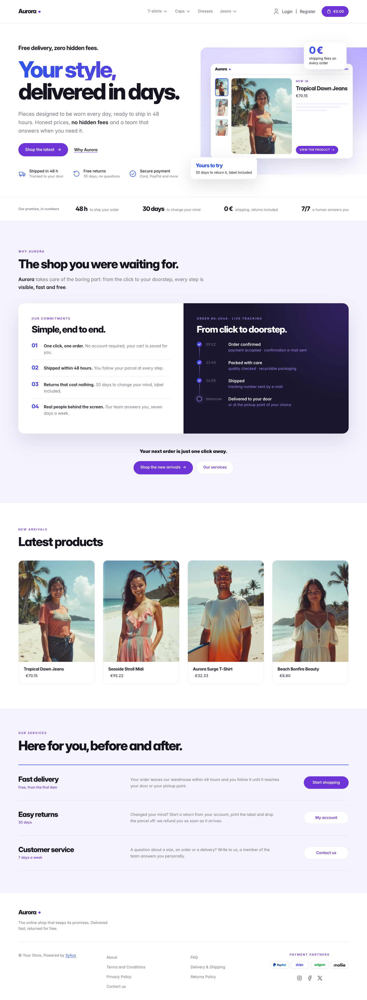
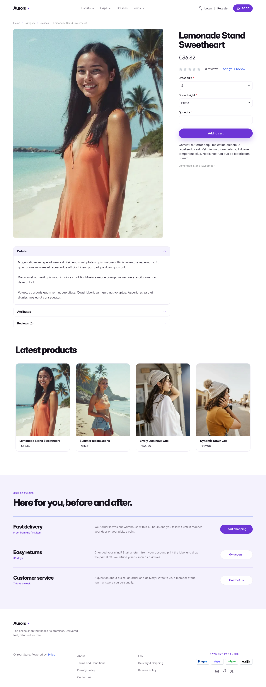
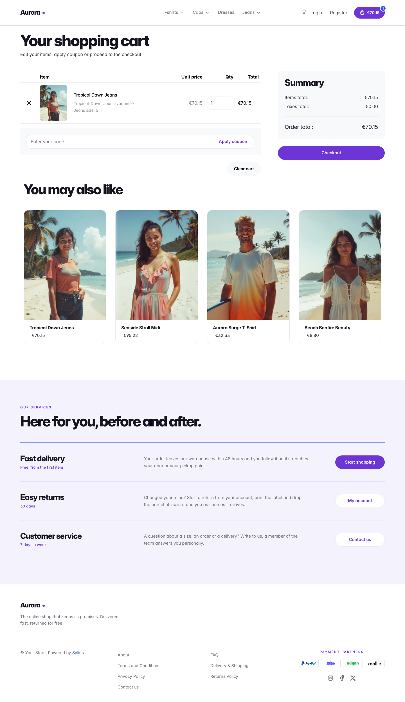

# Aurora theme

Aurora is the violet sibling of [Lagoon](lagoon.md): the same airy, product-led
landing-page structure, but lit by an electric-blue-to-violet gradient over
lavender sections and midnight panels. It is set in tightly-tracked *Inter*
(already shipped by the Sylius shop, so no extra font file is needed).

| Homepage                                                     | Product page                                            | Cart                                                           |
|--------------------------------------------------------------|---------------------------------------------------------|----------------------------------------------------------------|
|  |  |  |

- **Palette** — electric blue (`#2F55E8`), violet (`#6D35D6`), midnight
  (`#1A1830`) and lavender (`#F4F2FD`) on a white background. The blue-to-violet gradient is the theme signature
  (headline, figures, `.aurora-btn-glow`).
- **Components** — violet pill buttons (white pills with violet text for
  secondary actions), white product cards with the image flush to the top that
  lift on hover (the whole card is clickable, on the homepage and on category
  pages alike),
  quiet text-only breadcrumbs, a violet cart pill with a blue item counter, a
  full-width violet add-to-cart button, and no default header top bar.
- **Homepage** — a split hero whose first headline line glows from blue to
  violet, with three reassurance items and a lavender panel that bleeds off the
  page edge. It holds a **miniature product page**: thumbnails of the three
  latest products of the channel and the newest one in focus, with its real
  image, name and price. A **proof strip** of key numbers follows (shipping
  delay, return period, fees, support). The promise block (`theme_promise`
  hookable) sits on a lavender background: a **split card** with four
  numbered commitments on white and the **journey of an order** as a
  timeline on midnight (the next step softly pulses), followed by two calls
  to action. Then come the
  four latest products; the deals and new collection blocks are hidden.
- **Footer** — a lavender **services** band (delivery, returns, customer
  service: one row each, with a tag, a description and a button to the
  storefront, the customer account and the contact page) above a light footer
  with the Aurora wordmark and Sylius links.
- **Product page** — the price sits directly below the product name, before reviews.
- **Checkout** — the checkout header uses the Aurora wordmark and responsive
  category navigation.
- **Translations** — every Aurora-specific text lives in its own `aurora`
  translation domain (`translations/aurora.en.yaml` and `aurora.fr.yaml`), so it
  can be edited or translated without touching the templates.
- **Accessibility** — visible blue focus rings, decorative mockups hidden from
  assistive technologies, and no motion for visitors who prefer reduced motion.

## Aurora or Lagoon?

| | Lagoon | Aurora |
|---|---|---|
| Mood | deep-water teal and aqua | electric blue, violet and midnight |
| Hero visual | storefront window, one product | miniature product page, three products and a price |
| Under the hero | — | proof strip of key numbers |
| Promise | "You replace / You keep" comparison | numbered commitments and an order timeline, same split card |
| Footer | dark band with "how it works" steps | lavender services rows with calls to action |
| Product cards | white cards, mint image well | white cards, lavender image well, violet title on hover |

Install it with `castor sylius:theme:setup aurora`.
