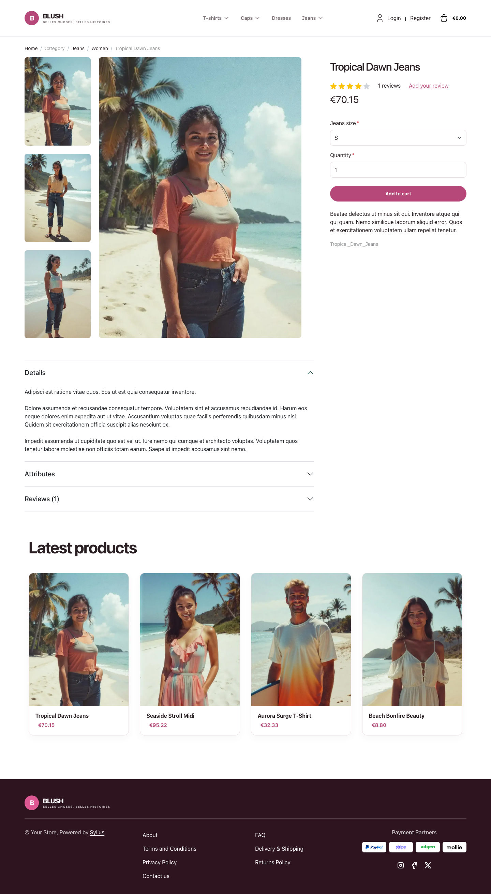

# Blush theme

Blush adapts the visual language of the
[JoliCode Sylius Starter](https://jolicode.github.io/sylius-starter/fr/) landing
page into a storefront: a crisp white canvas, expressive raspberry accents,
soft rose panels and a deep plum footer.

| Homepage                                                   | Product page                                          | Cart                                                         |
|------------------------------------------------------------|-------------------------------------------------------|--------------------------------------------------------------|
|  |  |  |

- **Palette** — white and pale rose surfaces (`#FFFFFF`, `#FBF6F8`), raspberry
  (`#B54878`) accents and plum (`#2D141F`) typography and footer.
- **Components** — rounded buttons and product cards, a custom wordmark and
  responsive taxon navigation.
- **Product cards** — rounded white cards with a pale rose image well and a soft
  plum shadow, raspberry prices, a lift on hover; the whole card is clickable, on
  the homepage and on category pages alike.
- **Homepage** — a French editorial hero with a CSS illustration, a direct
  link to the latest products and a link to the promise block; then the
  *"Our little promises"* block (four rose cards with coloured badges, through
  the `theme_promise` hookable) and four latest products; the latest deals and
  new-collection blocks are hidden.
- **Shopping flow** — matching buttons, forms and checkout branding, including
  the Blush wordmark and category navigation in the checkout header.
- **Translations** — the homepage texts live in a `blush` translation domain
  (`translations/blush.en.yaml` and `blush.fr.yaml`).

Install it with `castor sylius:theme:setup blush`.
