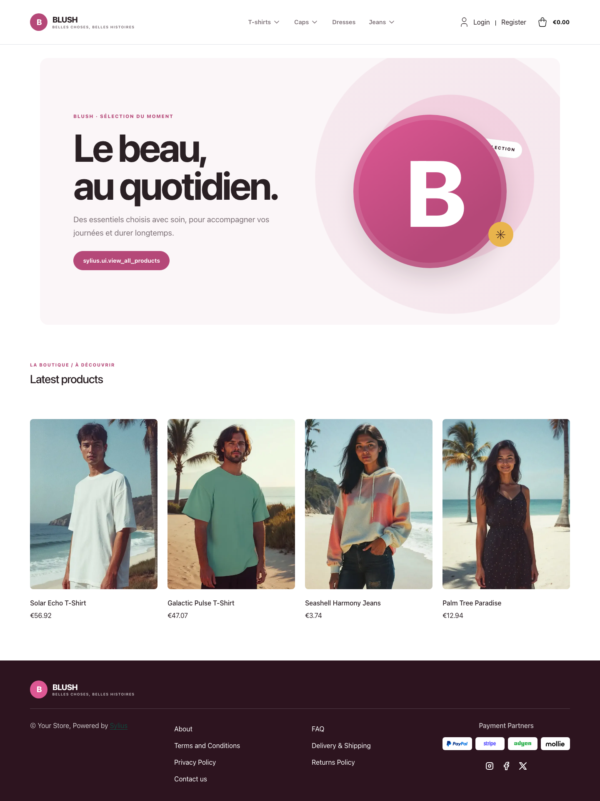
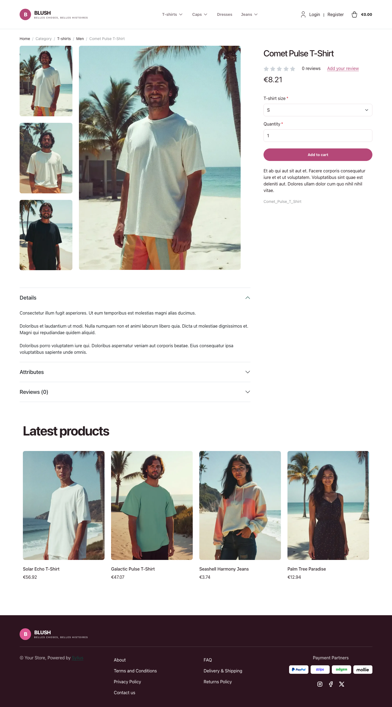
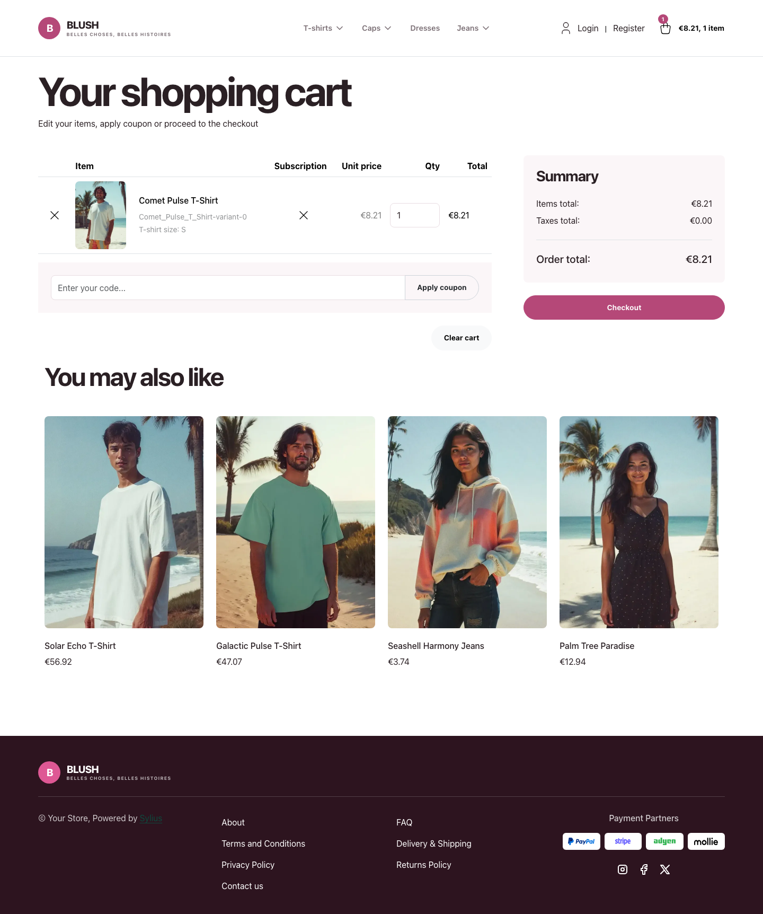

# Blush theme

Blush adapts the visual language of the
[JoliCode Sylius Starter](https://jolicode.github.io/sylius-starter/fr/) landing
page into a storefront: a crisp white canvas, expressive raspberry accents,
soft rose panels and a deep plum footer.

| Homepage                                                   | Comet Pulse T-Shirt                                                                   | Cart                                                                       |
|------------------------------------------------------------|---------------------------------------------------------------------------------------|----------------------------------------------------------------------------|
|  |  |  |

- **Palette** — white and pale rose surfaces (`#FFFFFF`, `#FBF6F8`), raspberry
  (`#B54878`) accents and plum (`#2D141F`) typography and footer.
- **Components** — rounded buttons and product cards, a custom wordmark and
  responsive taxon navigation.
- **Homepage** — a French editorial hero with a CSS illustration and a direct
  link to the latest products, followed by four latest products; the latest
  deals and new-collection blocks are hidden.
- **Shopping flow** — matching buttons, forms and checkout branding, including
  the Blush wordmark and category navigation in the checkout header.

Install it with `castor sylius:theme:setup blush`.
