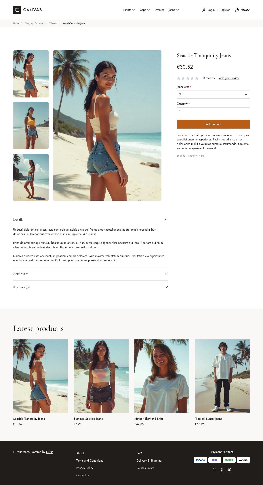

# Canvas theme

Canvas gives the storefront a clean, editorial look, with warm neutral colors,
squared corners and a refined pairing of *Jost* (body) and *Cormorant Garamond*
(headings).

| Homepage                                                     | Product page                                            | Cart                                                           |
|--------------------------------------------------------------|---------------------------------------------------------|----------------------------------------------------------------|
|  |  |  |

The theme restyles the shop through SCSS overrides and Sylius Twig hooks:

- **Palette** — charcoal (`#211D1B`), paper (`#F7F6F3`) and off-white (`#FAF8F6`)
  neutrals, with a terracotta accent (`#B75D17`) for primary buttons.
- **Layout** — squared corners everywhere (no border radius), minimal borders and
  generous spacing; the footer is rendered in dark charcoal.
- **Header** — the default top bar and navbar are replaced by a single taxon navigation.
- **Checkout** — the checkout header uses the Canvas wordmark and category navigation.
- **Branding** — a dedicated Canvas wordmark appears in the header; the footer has no logo,
  and breadcrumbs stay text-only.
- **Homepage** — an editorial "magazine cover" hero: a large Cormorant headline
  with a terracotta italic accent, a call to action, and a collage of the
  **three latest products of the channel** (real images, numbered captions, no
  external image); then a strip of three numbered commitments and the four
  latest products with squared pictures. The deals and collection blocks are
  removed.
- **Product page** — a full-width breadcrumb band, the price directly below the
  product name and before reviews, a full-width add-to-cart button, and a listing
  of associated products (or latest products when there are none).
- **Typography** — Cormorant Garamond (300–700) and Jost (100–900) are loaded
  as variable fonts, so every weight is the real one.
- **Translations** — the homepage texts live in a `canvas` translation domain
  (`translations/canvas.en.yaml` and `canvas.fr.yaml`).
- **Login page** — a split-screen layout with a full-height image beside the
  login/register panel.

Install it with `castor sylius:theme:setup canvas`.
