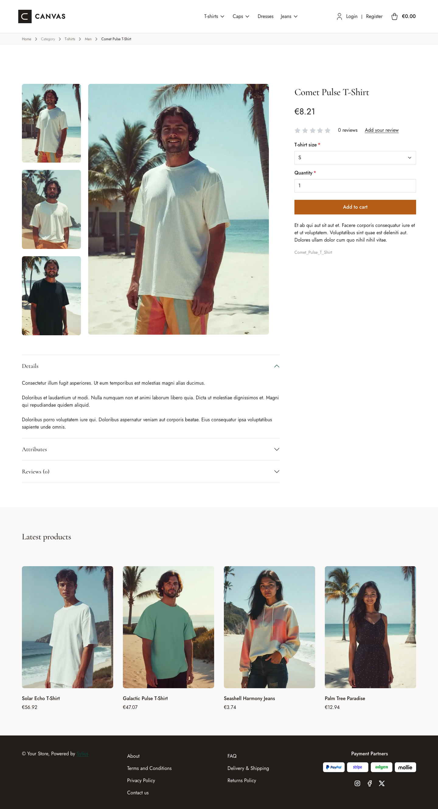

# Canvas theme

Canvas gives the storefront a clean, editorial look, with warm neutral colors,
squared corners and a refined pairing of *Jost* (body) and *Cormorant Garamond*
(headings).

| Homepage                                                     | Comet Pulse T-Shirt                                                                     | Cart                                                                         |
|--------------------------------------------------------------|-----------------------------------------------------------------------------------------|------------------------------------------------------------------------------|
|  |  |  |

The theme restyles the shop through SCSS overrides and Sylius Twig hooks:

- **Palette** — charcoal (`#211D1B`), paper (`#F7F6F3`) and off-white (`#FAF8F6`)
  neutrals, with a terracotta accent (`#B75D17`) for primary buttons.
- **Layout** — squared corners everywhere (no border radius), minimal borders and
  generous spacing; the footer is rendered in dark charcoal.
- **Header** — the default top bar and navbar are replaced by a single taxon navigation.
- **Checkout** — the checkout header uses the Canvas wordmark and category navigation.
- **Branding** — a dedicated Canvas wordmark appears in the header; the footer has no logo,
  and breadcrumbs stay text-only.
- **Homepage** — a full-width banner and a "latest products" section; the deals and
  collection blocks are removed.
- **Product page** — a full-width breadcrumb band, the price directly below the
  product name and before reviews, a full-width add-to-cart button, and a listing
  of associated products (or latest products when there are none).
- **Login page** — a split-screen layout with a full-height image beside the
  login/register panel.

Install it with `castor sylius:theme:setup canvas`.
