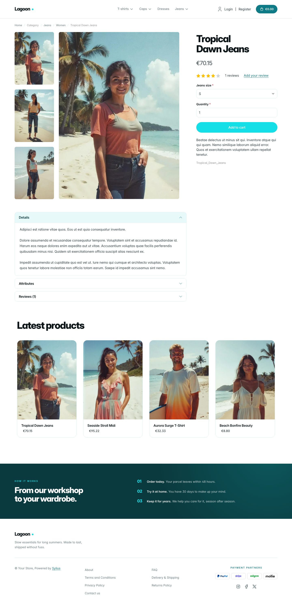
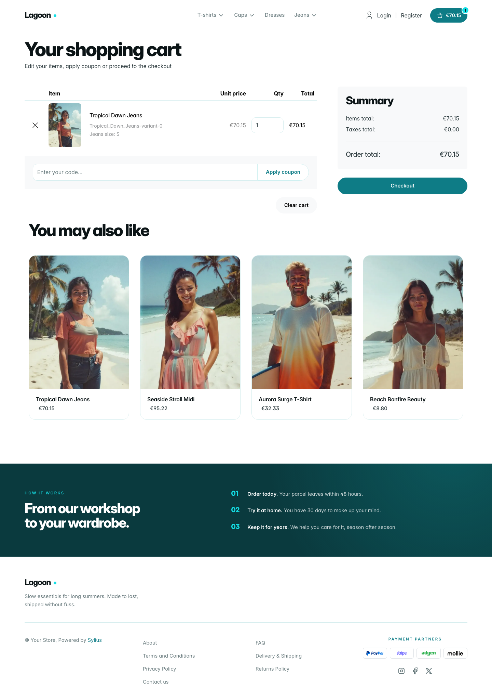

# Lagoon theme

Lagoon brings the airy, product-led look of a modern SaaS landing page to the
storefront: deep-water teal panels, bright aqua calls to action, mint "foam"
sections and a touch of iris violet, set in tightly-tracked *Inter* (already
shipped by the Sylius shop, so no extra font file is needed).

| Homepage                                                     | Product page                                            | Cart                                                           |
|--------------------------------------------------------------|---------------------------------------------------------|----------------------------------------------------------------|
|  |  |  |

- **Palette** — abyss teal (`#0A3A3E`), teal (`#0E7C86`), aqua (`#14DFE6`),
  mint foam (`#E7F9F9`) and an iris accent (`#6B3FE0`) on a white background.
- **Components** — pill-shaped buttons (teal for primary actions, aqua for
  highlights), white product cards with a mint image well, quiet
  text-only breadcrumbs, a teal cart pill with an aqua item counter, a full-width
  aqua add-to-cart button, and no default header top bar.
- **Product cards** — white cards with a mint image well flush to the top, name
  and price aligned, a lift and a teal title on hover; the whole card is
  clickable, on the homepage and on category pages alike.
- **Homepage** — a split hero with oversized copy, three reassurance items and a
  floating "storefront window" that showcases the **latest product of the
  channel** (real image and link, no static asset), a *"You replace / You keep"*
  comparison section on a mint background (the promise block, through the
  `theme_promise` hookable), then the four latest products; the
  deals and new collection blocks are hidden.
- **Footer** — a deep-teal band with numbered "how it works" steps above a light
  footer with the Lagoon wordmark and Sylius links.
- **Product page** — the price sits directly below the product name, before reviews.
- **Checkout** — the checkout header uses the Lagoon wordmark and responsive
  category navigation.
- **Translations** — every Lagoon-specific text lives in its own `lagoon`
  translation domain (`translations/lagoon.en.yaml` and `lagoon.fr.yaml`), so it
  can be edited or translated without touching the templates.
- **Accessibility** — visible aqua focus rings and no motion for visitors who
  prefer reduced motion.

Install it with `castor sylius:theme:setup lagoon`.
