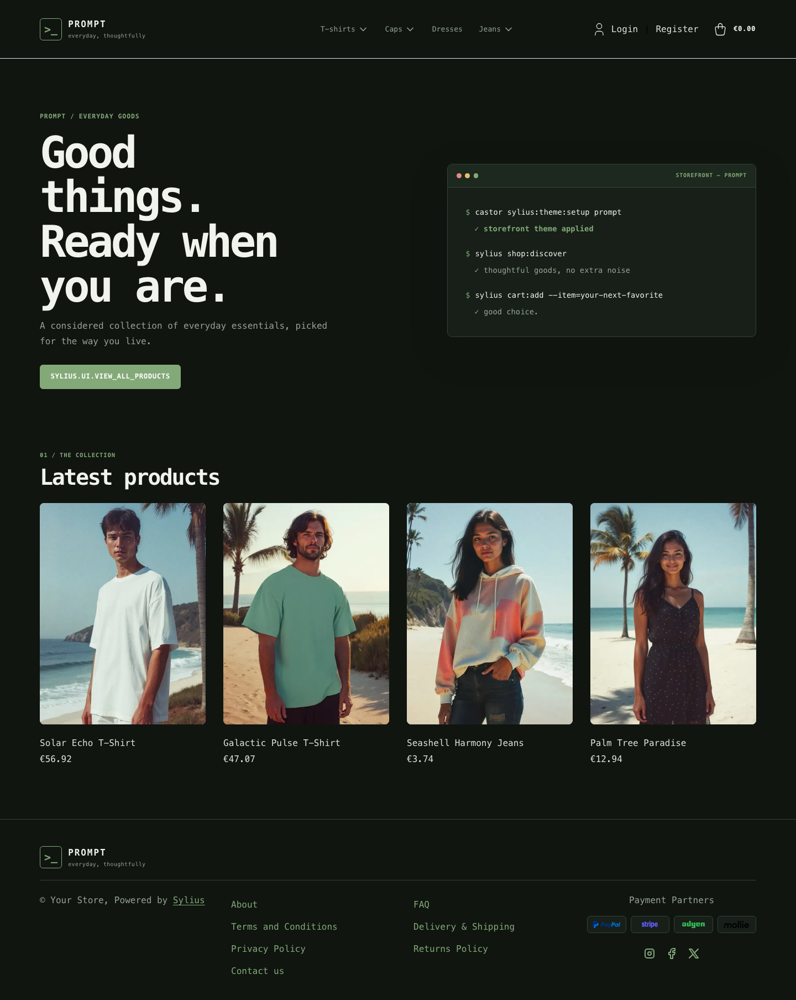
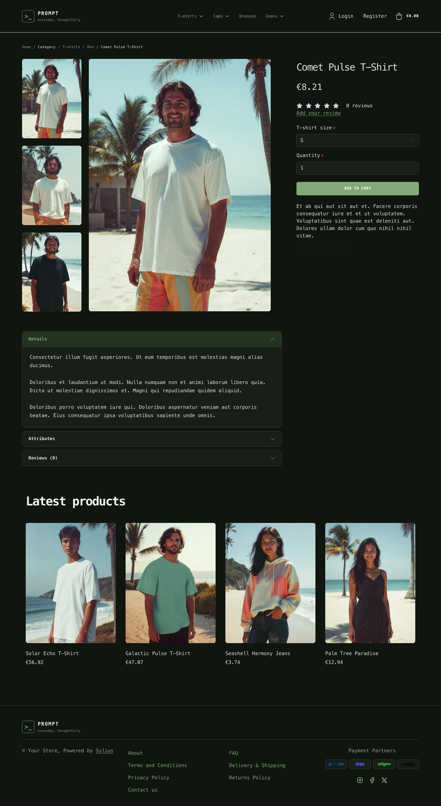

# Prompt Dark theme

Prompt Dark is the terminal-inspired storefront direction: a dark workspace,
terminal-green accents, monospaced typography and a command-inspired homepage
panel.

| Homepage                                                               | Comet Pulse T-Shirt                                                                               | Cart                                                                                   |
|------------------------------------------------------------------------|---------------------------------------------------------------------------------------------------|----------------------------------------------------------------------------------------|
|  |  |  |

- **Palette** — deep green-black surfaces, terminal green highlights and muted
  neutral text.
- **Components** — compact square-edged controls, a responsive category menu,
  dark product cards, an accessible off-canvas cart and a matching footer.
- **Homepage** — a two-column introduction with a terminal-style panel and a
  direct link to the latest products.
- **Shopping flow** — matching cart and checkout styling, with light sage
  summary panels for contrast.
- **Checkout** — the checkout header uses the Prompt wordmark and category navigation.

Install it with `castor sylius:theme:setup prompt_dark`.
