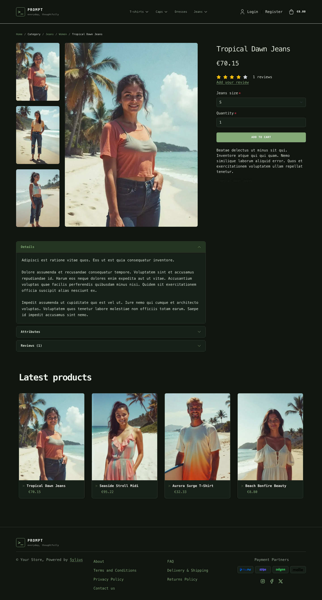

# Prompt Dark theme

Prompt Dark is the terminal-inspired storefront direction: a dark workspace,
terminal-green accents, monospaced typography and a command-inspired homepage
panel.

| Homepage                                                               | Product page                                                      | Cart                                                                     |
|------------------------------------------------------------------------|-------------------------------------------------------------------|--------------------------------------------------------------------------|
|  |  |  |

- **Palette** — deep green-black surfaces, terminal green highlights and muted
  neutral text.
- **Components** — compact square-edged controls, a responsive category menu,
  dark product cards, an accessible off-canvas cart and a matching footer.
- **Product cards** — raised dark cards with a `>` prompt before the product name
  (it lights up on hover), green prices and a green border on hover; the whole
  card is clickable, on the homepage and on category pages alike.
- **Homepage** — a two-column introduction with a terminal-style panel, a
  direct link to the latest products and a link to the promise block; then the
  promise block, a *"before / after"* written as a `git diff` (through the
  `theme_promise` hookable), and the latest products.
- **Shopping flow** — matching cart and checkout styling, with light sage
  summary panels for contrast.
- **Checkout** — the checkout header uses the Prompt wordmark and category navigation.
- **Translations** — the homepage texts live in a `prompt` translation domain
  (`translations/prompt.en.yaml` and `prompt.fr.yaml`).

Install it with `castor sylius:theme:setup prompt_dark`.
