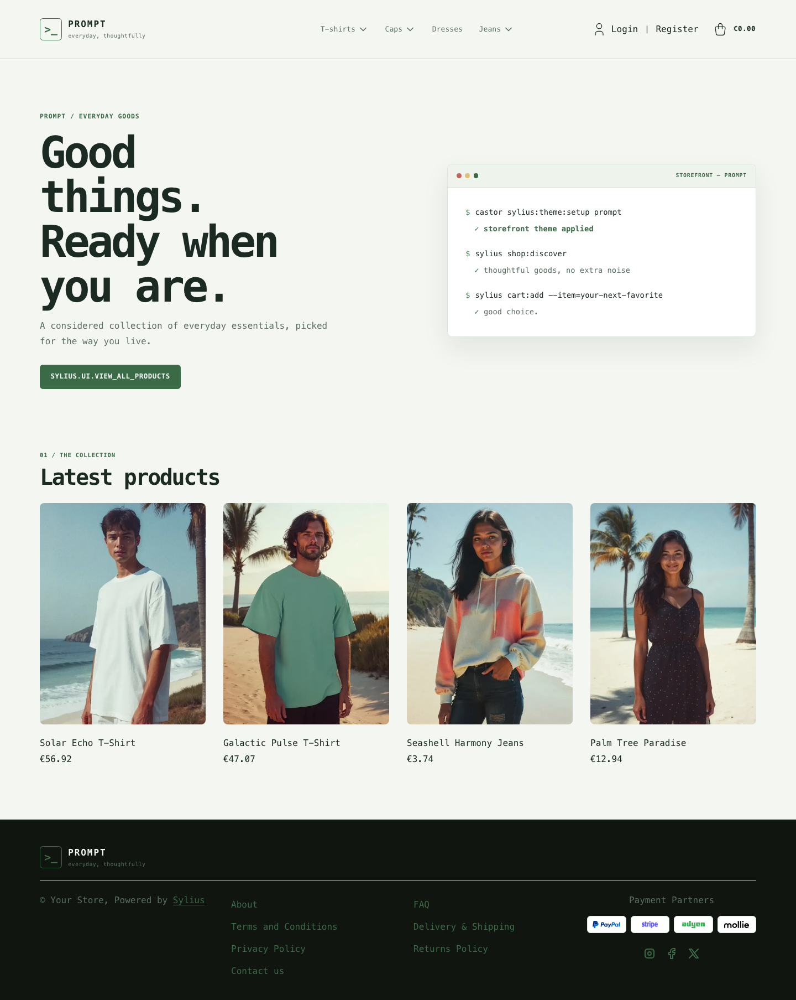
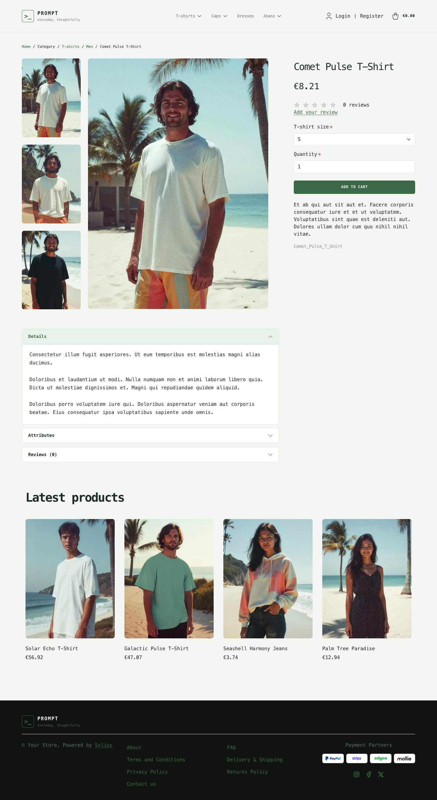
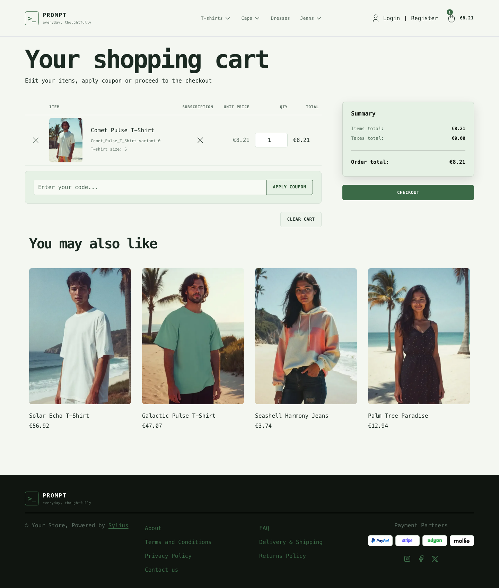

# Prompt Light theme

Prompt Light keeps the same terminal-inspired layout and compact visual language
as Prompt, but swaps its dark workspace for a brighter palette: soft green paper,
crisp dark typography and calmer contrast.

| Homepage                                                                 | Comet Pulse T-Shirt                                                                                 | Cart                                                                                     |
|--------------------------------------------------------------------------|-----------------------------------------------------------------------------------------------------|------------------------------------------------------------------------------------------|
|  |  |  |

- **Palette** — pale moss backgrounds, forest-green accents and warm neutral text.
- **Components** — the same monospaced terminal framing, but with airy light panels,
  bright callouts and high-contrast controls.
- **Homepage** — a lighter command-console hero that keeps the direct link to the
  latest products, without losing the terminal aesthetic.
- **Shopping flow** — matching cart, checkout and product cards with calmer contrast
  for better readability.

Install it with `castor sylius:theme:setup prompt_light`.
