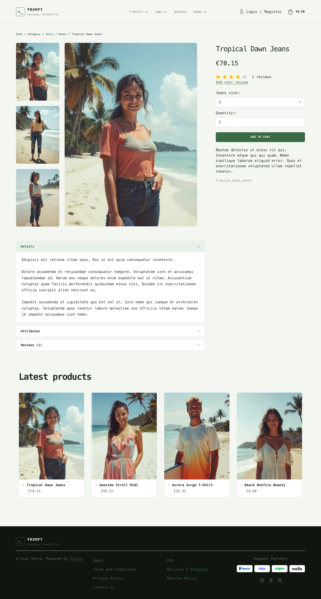

# Prompt Light theme

Prompt Light keeps the same terminal-inspired layout and compact visual language
as Prompt, but swaps its dark workspace for a brighter palette: soft green paper,
crisp dark typography and calmer contrast.

| Homepage                                                                 | Product page                                                        | Cart                                                                       |
|--------------------------------------------------------------------------|---------------------------------------------------------------------|----------------------------------------------------------------------------|
|  |  |  |

- **Palette** — pale moss backgrounds, forest-green accents and warm neutral text.
- **Components** — the same monospaced terminal framing, but with airy light panels,
  bright callouts and high-contrast controls.
- **Product cards** — white cards with a `>` prompt before the product name (it
  lights up on hover), green prices and a green border on hover; the whole card is
  clickable, on the homepage and on category pages alike.
- **Homepage** — a lighter command-console hero that keeps the direct link to the
  latest products, without losing the terminal aesthetic; then the promise block,
  a *"before / after"* written as a `git diff` (through the `theme_promise`
  hookable), and the latest products.
- **Shopping flow** — matching cart, checkout and product cards with calmer contrast
  for better readability.
- **Translations** — the homepage texts live in a `prompt` translation domain
  (`translations/prompt.en.yaml` and `prompt.fr.yaml`).

Install it with `castor sylius:theme:setup prompt_light`.
