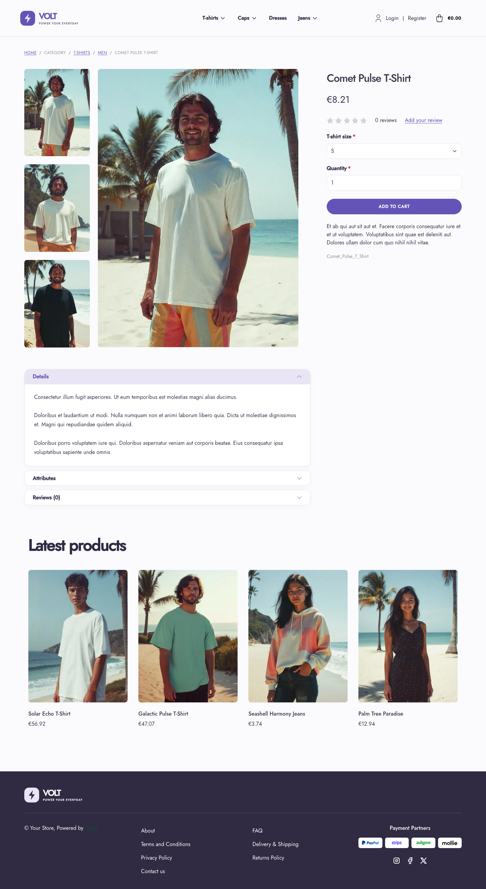
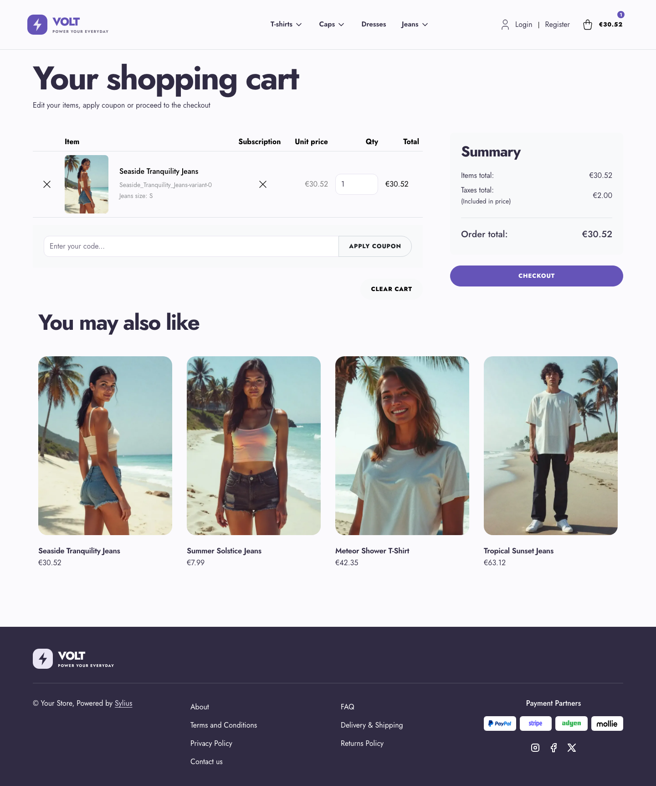

# Volt theme

Volt takes the opposite route: a high-energy, sport-tech storefront with electric
violet, soft-lavender accents, rounded components and bold Jost typography. Its
custom homepage banner uses layered CSS artwork, so it needs no additional image
assets.

| Homepage                                                 | Product page                                        | Cart                                                       |
|----------------------------------------------------------|-----------------------------------------------------|------------------------------------------------------------|
|  |  |  |

- **Palette** — plum ink (`#302B43`), electric violet (`#6554B8`) and soft
  lavender (`#E9E5F4`) over a subtle, near-white background.
- **Components** — pill-shaped buttons, soft rounded cards, pale high-contrast
  breadcrumbs, a custom Volt logo and a responsive category menu in the header,
  a dark footer with white links and light-backed payment logos, a full-width
  add-to-cart button, and no default header top bar.
- **Product page** — the price sits directly below the product name, before reviews.
- **Homepage** — an oversized, responsive graphic hero with a direct link to
  the latest products; new collection blocks are hidden.
- **Checkout** — the checkout header uses the Volt wordmark and responsive
  category navigation.

Install it with `castor sylius:theme:setup volt`.
